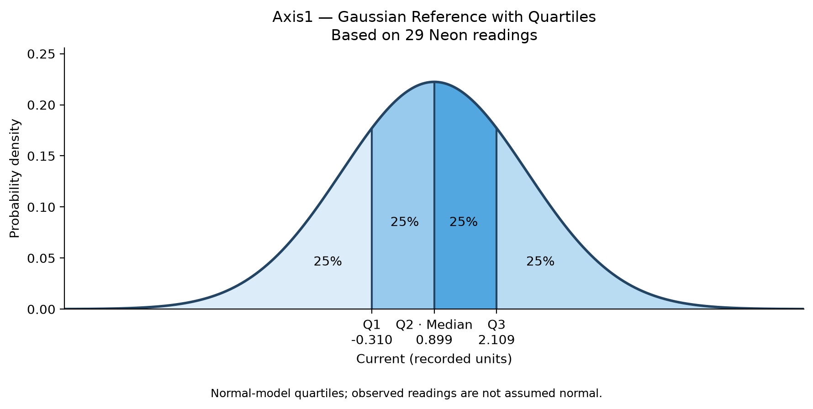
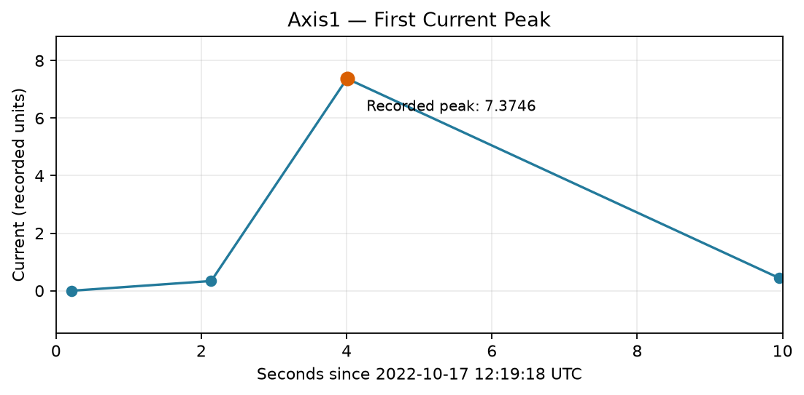

# Robot Data Wrangling with Pandas and Neon PostgreSQL

**Author:** Antonio Sainz  
**Course:** PROG8245  
**Instructor:** Professor Espinoza

This project adapts the instructor's
[Wrangling Workshop](https://github.com/ProfEspinosaAIML/WranglingWorkshop)
to recorded robot electrical-current data and a synthetic shop catalog.

## 1. Objective

Combine robot measurements with shop information, inspect data quality,
create descriptive features, and verify that a PostgreSQL join produces
the same values as a pandas merge.

The project covers:

- CSV loading, Series, and DataFrame inspection.
- Missing-value checks and explicit timestamp conversion.
- Left, inner, right, and outer merges.
- Measurement-based feature engineering.
- Hourly pivot tables and visualizations.
- Pearson correlations.
- Neon PostgreSQL table creation and sample loading.
- SQL queries read into pandas.
- Normalization of inconsistent join keys.
- Short-window analysis using a simple Python class.
- Gaussian reference quartiles and a recorded-peak close-up.

## 2. Results

| Verification | Observed result |
|---|---:|
| Original dataset | 39,672 rows and 16 columns |
| Selected measurement channels | 6 |
| Missing or invalid timestamps | 0 |
| Duplicate timestamps | 0 |
| Sampling intervals exceeding 10 seconds | 6 |
| Full pandas left-merge result | 39,672 measurements |
| Synthetic shop records | 3 |
| Notebook 2 sample verified in Neon | 1,000 |
| Notebook 3 selected minute | 29 |
| Total distinct measurements after both loads into an empty database | 1,028 |
| SQL join versus pandas merge | Identical sample values |
| Challenge matches before normalization | 333 |
| Challenge matches after normalization | 1,000 |

These results were observed during local notebook execution.
The instructions below allow an evaluator to reproduce and verify them.

## 3. Data Sources and Assumptions

### Original Recording

Source file:

`data/raw/RMBR4-2_export_test.csv`

The recording contains:

- `Trait`: measurement type, recorded as `current`.
- `Time`: original timestamp.
- `Axis #1` through `Axis #14`: recorded channels.

Channels 1–8 contain measurements. Channels 9–14 are empty.
The simplified laboratory uses channels 1–6.

| Property | Value |
|---|---|
| First timestamp | 2022-10-17 12:18:23.660 UTC |
| Last timestamp | 2022-10-18 10:44:58.628 UTC |
| Median sampling interval | 1.891 seconds |
| Largest sampling interval | 402.538 seconds |

The original CSV remains unchanged.

The robot identifier `RMBR4-2` is taken from the source filename.
Physical current units have not been independently verified, so
results are reported in **recorded units**.

### Synthetic Context

The following values were created for the exercise:

- Shop identifiers and robot-to-shop assignment.
- Takt values, expressed in seconds per unit.
- The documentation-only IP address `192.0.2.10`.

| Shop_ID | Takt (seconds per unit) |
|---|---:|
| SH01 | 120 |
| SH02 | 90 |
| SH03 | 150 |

All recorded measurements are assigned to SH01.
SH02 and SH03 demonstrate shops without corresponding measurements.

No synthetic manufacturing operations or additional robot
measurements are generated.

## 4. Table Structure

| Table | Columns |
|---|---|
| Shops | Shop_ID, Takt |
| Robots | Robot_ID, Timestamp, Axis1–Axis6, IP_ADDRESS, Shop_ID |

The PostgreSQL tables use lowercase identifiers in the `wrangling`
schema:

- `wrangling.shops`: primary key `shop_id`.
- `wrangling.robots`: composite primary key `(robot_id, timestamp)`.
- `wrangling.robots.shop_id`: foreign key referencing `shops.shop_id`.

Robot_ID identifies a robot but repeats across its measurements.
The timestamp is therefore included in the measurement primary key.

PostgreSQL stores timestamps as `TIMESTAMPTZ`, axis values as
`DOUBLE PRECISION`, and IP addresses as `INET`.

## 5. Repository Structure

```text
.
├── README.md
├── requirements.txt
├── .env.example
├── .gitignore
├── notebooks/
│   ├── 01_robot_data_inspection.ipynb
│   ├── 02_synthetic_manufacturing_data.ipynb
│   └── 03_current_distribution.ipynb
├── data/
│   ├── raw/
│   │   └── RMBR4-2_export_test.csv
│   ├── processed/                 # Generated by notebook 1
│   └── workshop/                  # Generated by notebook 2
└── reports/
    ├── data_inspection/
    ├── merge_analysis/
    ├── feature_analysis/
    ├── hourly_analysis/
    ├── correlation_analysis/
    ├── sql_validation/
    ├── merge_challenge/
    ├── current_distribution/      # Generated by notebook 3
    └── execution/                 # Generated by automated execution
```

The instructor's original notebooks, scripts, and example datasets
are retained as reference material.

To reproduce this adaptation, execute only the three notebooks inside
`notebooks/`, in the documented order.

## 6. Fresh-Environment Prerequisites

The instructions below target **Windows PowerShell**.

An evaluator needs:

1. A checkout or extracted copy of this submitted repository.
2. Python 3.12 with pip and venv.
3. Internet access for installing packages and connecting to Neon.
4. A Neon PostgreSQL database dedicated to this exercise.
5. A database role permitted to create schemas and tables and read
   and write records.

Local development used Python **3.12.7**.
Package versions are recorded in `requirements.txt`.

Start from the repository root, where `README.md`,
`requirements.txt`, `notebooks/`, and `data/` are located.

The reproduction process does not require pre-existing generated
reports or processed CSV files. Notebook 1 generates the input needed
by notebook 2.

### Neon Setup

1. Sign in to the [Neon console](https://console.neon.tech/).
2. Create a project or select a dedicated empty database.
3. Open **Connect**.
4. Select the intended branch, database, and role.
5. Copy the PostgreSQL connection URI, preserving its SSL parameters.

Each evaluator must provide their own database credentials.
The author's credentials are not included.

## 7. Create the Python Environment

Run the following block from the repository root:

```powershell
& {
    $ErrorActionPreference = "Stop"

    py -3.12 -m venv .venv
    if ($LASTEXITCODE -ne 0) {
        throw "Python environment creation failed."
    }

    .\.venv\Scripts\python.exe -m pip install -r requirements.txt
    if ($LASTEXITCODE -ne 0) {
        throw "Dependency installation failed."
    }

    .\.venv\Scripts\python.exe -m ipykernel install `
        --sys-prefix `
        --name wranglingworkshop `
        --display-name "Python (WranglingWorkshop)"

    if ($LASTEXITCODE -ne 0) {
        throw "Kernel registration failed."
    }

    .\.venv\Scripts\python.exe -c "import pandas, numpy, matplotlib, sqlalchemy, psycopg2, dotenv, nbconvert; print('PASS: required packages are available.')"

    if ($LASTEXITCODE -ne 0) {
        throw "Package import verification failed."
    }
}
```

Environment activation is unnecessary because all commands explicitly
use the virtual environment's Python executable.

## 8. Configure the Local Connection

Create `.env` from the template if it does not already exist:

```powershell
if (-not (Test-Path -LiteralPath ".env")) {
    Copy-Item -LiteralPath ".env.example" -Destination ".env"
}
```

Set this entry in `.env` to your actual Neon connection URI:

```dotenv
NEON_DATABASE_URL="YOUR_NEON_POSTGRESQL_CONNECTION_URI"
```

Place `.env` in the repository root.

The notebook reads this file directly using `python-dotenv`.
Providing only a process environment variable does not replace
the required file in this implementation.

### Automated Evaluation

Before execution, provision `.env` with a valid connection URI.
No interactive credential prompt is used.

The database must be reachable and the role must have the permissions
listed above. Without these prerequisites, the complete Neon workflow
cannot run.

The `.env` file is excluded from Git. The shareable `.env.example`
contains only a placeholder.

Do not include credentials in source code, notebook outputs,
screenshots, or commits.

## 9. Execute from a Fresh Kernel

Execute notebooks 1, 2, and 3 in order:

1. `01_robot_data_inspection.ipynb`
2. `02_synthetic_manufacturing_data.ipynb`
3. `03_current_distribution.ipynb`

The following block executes all three automatically and saves separate
executed copies without overwriting the source notebooks:

```powershell
& {
    $ErrorActionPreference = "Stop"
    $previousJupyterPath = $env:JUPYTER_PATH

    try {
        $env:JUPYTER_PATH = Join-Path `
            (Get-Location).Path ".venv\share\jupyter"

        $executionFolder = Join-Path `
            (Get-Location).Path "reports\execution"

        New-Item -ItemType Directory `
            -Force -Path $executionFolder | Out-Null

        $notebooks = @(
            "01_robot_data_inspection",
            "02_synthetic_manufacturing_data",
            "03_current_distribution"
        )

        foreach ($notebook in $notebooks) {
            .\.venv\Scripts\python.exe -m nbconvert `
                --to notebook `
                --execute "notebooks\$notebook.ipynb" `
                --ExecutePreprocessor.kernel_name=wranglingworkshop `
                --ExecutePreprocessor.timeout=180 `
                --output "$notebook.executed.ipynb" `
                --output-dir "$executionFolder"

            if ($LASTEXITCODE -ne 0) {
                throw "Notebook execution failed: $notebook"
            }

            .\.venv\Scripts\python.exe -m nbconvert `
                --to html `
                "$executionFolder\$notebook.executed.ipynb" `
                --output "$notebook.report" `
                --output-dir "$executionFolder"

            if ($LASTEXITCODE -ne 0) {
                throw "HTML report generation failed: $notebook"
            }
        }

        Write-Host "PASS: all three notebooks executed and HTML reports generated."
    }
    finally {
        $env:JUPYTER_PATH = $previousJupyterPath
    }
}
```

Each notebook execution starts a new kernel.
Errors stop the process; execution does not use `--allow-errors`.

Generated outputs include:

```text
reports/execution/
├── 01_robot_data_inspection.executed.ipynb
├── 01_robot_data_inspection.report.html
├── 02_synthetic_manufacturing_data.executed.ipynb
├── 02_synthetic_manufacturing_data.report.html
├── 03_current_distribution.executed.ipynb
└── 03_current_distribution.report.html
```

The 180-second setting is a per-cell timeout, not a promised runtime.

## 10. Verify Successful Reproduction

Inspect the executed notebooks or HTML reports.

Expected checkpoints include:

```text
PASS: Connected to Neon PostgreSQL.
```

Expected counts for an initially empty database:

| Stage | ShopRows | MeasurementRows |
|---|---:|---:|
| After notebook 2 | 3 | 1000 |
| After notebook 3 | 3 | 1028 |

One of the 29 minute readings overlaps the sample, so notebook 3 adds 28 records.
Repeat loads preserve 1,028 records for this unchanged dataset.
Notebook 2 verifies its exact 1,000 sample keys even when additional records exist.

Expected SQL validation:

```text
Verified sample measurements: 1,000
PASS: Neon SQL and pandas merge return the same values.
```

Expected challenge result:

| Stage | MatchedRows | UnmatchedRows |
|---|---:|---:|
| Before normalization | 333 | 667 |
| After normalization | 1000 | 0 |

Expected final messages include:

```text
PASS: Normalization recovered the clean sample merge.
Challenge evidence saved.
```

The SQL comparison checks all values after aligning column order,
row order, and UTC timestamps. Storage-type differences such as
integer versus floating-point takt do not invalidate equal values.

### Database Sample

Neon receives 1,000 evenly spaced row positions selected from the
chronologically ordered recording.

This sample is:

- Deterministic.
- Distributed across the recording.
- Not random.
- Not uniformly spaced in elapsed time.

The exact sample is exported to `data/workshop/robots_sample.csv`.

Earlier descriptive reports use all 39,672 observations.
SQL verification and the challenge use the 1,000-record sample.

### Repeatability and Existing Data

The database load uses multi-row inserts inside one transaction.

`ON CONFLICT DO NOTHING` skips existing primary keys, allowing an
unchanged sample to be loaded again without duplicates.

Existing values are not updated, and unrelated records are not deleted.
Changed values for selected keys may cause verification to fail.
Notebook 2 compares only its exact sample keys; unrelated records do not affect it.

For independent grading, use a dedicated empty database.
The notebooks do not automatically reset an existing database.

## 11. Visual Evidence

### Original Current Patterns


Five-minute sample means show higher recorded averages in channels
2 and 3 and several shared low-current periods.

Sampling gaps longer than 10 seconds are highlighted.
The threshold is an exploratory choice, not a robot specification.

These means are sample-based rather than time-weighted.

### Measurement-Based Features


The features describe readings at each timestamp:

- `NonZeroAxisCount`: number of nonzero channels.
- `AllAxesZero`: whether all six channels record zero.

All six channels are zero in **64.47%** of samples.
All six are nonzero in **32.82%** of samples.

These percentages do not measure operating time or confirmed downtime.

### Hourly Pivot Table


The pivot table groups by full UTC date and hour, shop, and robot.
The accompanying CSV includes the number of samples per group.

The first and last hours are partial, and sampling gaps affect coverage.
Recorded zeros remain included in the averages.

### Channel Correlations


The strongest off-diagonal correlation is approximately **0.536**
between Axis2 and Axis5.

The weakest is approximately **0.261** between Axis2 and Axis6.

Correlation describes linear association, not causation.
Shared zero periods may influence the results.

## 12. Saved Evidence

| File | Evidence |
|---|---|
| [Column completeness](reports/data_inspection/column_completeness.csv) | Types and missing values |
| [Timestamp summary](reports/data_inspection/timestamp_summary.csv) | Timestamp validation |
| [Sampling gaps](reports/data_inspection/sampling_gaps.csv) | Longer observation intervals |
| [Merge comparison](reports/merge_analysis/merge_comparison.csv) | Four merge types |
| [Shops without measurements](reports/merge_analysis/shops_without_measurements.csv) | Unmatched catalog entries |
| [Feature distribution](reports/feature_analysis/nonzero_channel_distribution.csv) | Nonzero-channel counts |
| [Hourly summary](reports/hourly_analysis/hourly_current_summary.csv) | Pivot-table results |
| [Correlation matrix](reports/correlation_analysis/axis_correlations.csv) | Numerical correlations |
| [Neon sample join](reports/sql_validation/neon_sample_join.csv) | SQL result verified against pandas |
| [Challenge matching summary](reports/merge_challenge/matching_summary.csv) | Before/after matching |
| [Normalized challenge result](reports/merge_challenge/normalized_merge_result.csv) | Cleaned join output |

The notebook outputs contain five-row previews with the join keys,
modified columns, or derived features displayed first.

## 13. Cleaning and Transformation Rules

All rules are implemented in notebook cells:

1. Preserve the original CSV.
2. Inspect all original channels before selecting channels 1–6.
3. Parse exported timestamps explicitly with `format="ISO8601"`.
4. Preserve timezone-aware timestamps in UTC.
5. Reject invalid or missing timestamps.
6. Validate measurement-key uniqueness.
7. Preserve recorded zeros.
8. Do not impute values when no measurements are missing.
9. Validate many-to-one merge relationships.
10. Normalize challenge keys using surrounding-whitespace removal
    and uppercase conversion.
11. Reject missing, empty, or duplicate normalized catalog keys.
12. Round only numerical display copies; preserve exported precision.

Unmatched shops in an outer merge have absent measurements.
Their missing robot values must not be replaced with zero.

## 14. Workshop Adaptation

| Instructor material | Adaptation |
|---|---|
| Data loading and inspection | Original robot CSV |
| Shared-key merging | Robots joined to Shops by Shop_ID |
| Missing values and types | Completeness checks and UTC conversion |
| Feature engineering | NonZeroAxisCount and AllAxesZero |
| Dates, pivot tables, and charts | Hourly current analysis |
| Correlation | Six recorded channels |
| SQL loading | Neon PostgreSQL read through pandas |
| Synthetic-data generation | Small deterministic shop catalog |
| Advanced merge challenge | Inconsistent shop-key normalization |

The challenge is intentionally simplified to respect the instructor's
two-table structure. It retains shop identifiers with inconsistent
formatting; it does not perform name-based entity matching.

## 15. Limitations

- The analysis covers one robot recording.
- Shop context is synthetic.
- No comparison of observed current between different shops is possible.
- Takt is constant for the observed shop.
- No relationship between takt and current can be estimated here.
- Current alone does not establish production counts, completed cycles,
  energy use, mechanical faults, or downtime.
- The sample is intended for SQL and merge practice, not cycle analysis.
- The implementation has been run locally; reproduction on another
  machine must be verified through the documented execution procedure.

## 16. Troubleshooting

| Issue | Resolution |
|---|---|
| Python 3.12 unavailable | Install Python 3.12 and rerun environment setup |
| Missing dependency | Install `requirements.txt` using `.venv` Python |
| Kernel not found | Register the kernel and use the documented JUPYTER_PATH |
| Processed CSV missing | Execute notebook 1 before notebook 2 |
| `.env` missing | Create it in the repository root |
| Neon connection failure | Check the URI, SSL parameters, credentials, and network |
| Database permission failure | Use a role permitted to create and populate the schema |
| SQL values differ from pandas | Check for older or additional database records |
| Expected figures missing | Execute the notebook sections that generate them |

Do not reveal `.env` contents when reporting connection problems.

## 17. Attribution and AI Assistance

This project is based on Professor Espinosa's
[Wrangling Workshop](https://github.com/ProfEspinosaAIML/WranglingWorkshop).

AI assistance supported code development, documentation, and
interpretation. The student executed the workflow and reviewed the
outputs.

Synthetic context is explicitly distinguished from original
measurements throughout the project.

## 18. Reproduction Verification

The first two notebooks were executed automatically using a newly created
`.venv-check` environment installed from `requirements.txt`.
Each notebook ran in a fresh kernel.

| Check | Result |
|---|---|
| Dependency installation in a new environment | Passed |
| Original data inspection notebook | Passed |
| Pandas and Neon workflow notebook | Passed |
| HTML report generation | Passed |
| Combined execution and HTML export time | 11.3 seconds |

### Executed Reports

- [Data inspection report](reports/execution/01_robot_data_inspection.report.html)
- [Pandas and Neon report](reports/execution/02_synthetic_manufacturing_data.report.html)

Download and open the HTML files in a browser if the repository
viewer displays their source instead of rendering them.

### Verification Scope

This check used a new Python environment on the same Windows computer
and the existing Neon database. It verifies fresh-environment execution
and repeat loading without duplicate records.

It does not constitute an independent test on another computer or
against a newly provisioned empty database.

Execution completed with non-fatal runtime warnings.
The HTML exporter also reported missing alternative text for three
images in the second report.

## 19. Week 4: Short-Window Current Analysis

Notebook `03_current_distribution.ipynb` continues the Neon workflow using Axis1 from robot RMBR4-2, joined to shop SH01 and its synthetic takt of 120 seconds per unit.

### Window and OOP

The interval 2022-10-17 12:19:10 UTC to 12:20:10 UTC (end excluded) contains 29 readings, including recorded zeros. The notebook loads the window, reads it through a Neon SQL join, and verifies all six channels and timestamps against the source. Statistics and final plots use the retrieved readings.

`RobotCurrentAnalysis` stores a copy of those readings. Its `summarize(axis)` method validates the channel and calculates quartiles, IQR, minimum, maximum, range, sample count, and zero count. The notebook demonstrates creating an object and calling its method.

### Gaussian Reference



The normal reference model uses the mean and population standard deviation (`ddof=0`) of the 29 observations. Each theoretical quartile region contains 25% of the full model probability. The displayed curve spans four standard deviations on either side, excluding tiny tails.

| Quartile | Normal model | Observed readings |
|---|---:|---:|
| Q1 | -0.3103 | 0.0000 |
| Q2 (median) | 0.8995 | 0.1303 |
| Q3 | 2.1092 | 0.4430 |

Observed quartiles use linear interpolation; the observed IQR is 0.4430. **The reference curve does not establish normality.** A negative model quartile does not indicate a recorded negative current. Statistics describe observations, not time-weighted behavior.

### First Recorded Peak



The interval 2022-10-17 12:19:18 UTC to 12:19:28 UTC (end excluded) contains four readings:

| Time (UTC) | Axis1 (recorded units) |
|---|---:|
| 12:19:18.218 | 0.00000 |
| 12:19:20.136 | 0.33876 |
| 12:19:22.005 | 7.37465 |
| 12:19:27.952 | 0.44300 |

The largest recorded value is 7.37465. The next observation is 5.947 seconds later. Dots are observations; connecting lines are guides. The exact physical peak, pulse shape, and duration cannot be determined from these readings. Current units remain unverified; this is not a measurement of power, energy, or physical movement.

### Evidence and Reproduction

- [Model and observed quartiles](reports/current_distribution/axis1_quartile_comparison.csv)
- [First-peak readings](reports/current_distribution/axis1_first_peak.csv)

Notebook 3 generates these CSVs and both PNGs. No extra dependency is needed: `statistics.NormalDist` belongs to Python's standard library.

### Reproduction and Verification Scope

Follow sections 6–9 and execute notebooks 1, 2, and 3 in order.
Notebook 2 creates the Neon schema and shop catalog required by notebook 3.

The workflow requires the raw CSV, a reachable Neon database, and valid
credentials in the local `.env`. Generated files and existing database
tables are not required before executing the complete sequence.

On October 1, 2026, all three notebooks were executed automatically
using the existing `.venv-check` verification environment. Each notebook
started in a separate fresh kernel.

| Verification | Result |
|---|---|
| Notebook 1: original data inspection | Passed |
| Notebook 2: pandas and Neon workflow | Passed |
| Notebook 3: short-window current analysis | Passed |
| HTML report generation for all three notebooks | Passed |
| Total execution and HTML export time | 18.6 seconds |

The verification environment was created during the previous session;
it was reused for this test. The test used the same Windows computer
and existing Neon database, not a newly provisioned database or another
computer.

Execution completed with non-fatal warnings, including a kernel
transport warning and missing alternative text for three images
reported during the third notebook's HTML export.

The earlier 11.3-second result in section 18 documents the previous
two-notebook verification.

#### Updated Executed Reports

- [Data inspection](reports/execution/01_robot_data_inspection.report.html)
- [Pandas and Neon workflow](reports/execution/02_synthetic_manufacturing_data.report.html)
- [Current distribution and first peak](reports/execution/03_current_distribution.report.html)

Download the HTML files and open them in a browser if the repository
viewer displays their source instead of rendering them.
